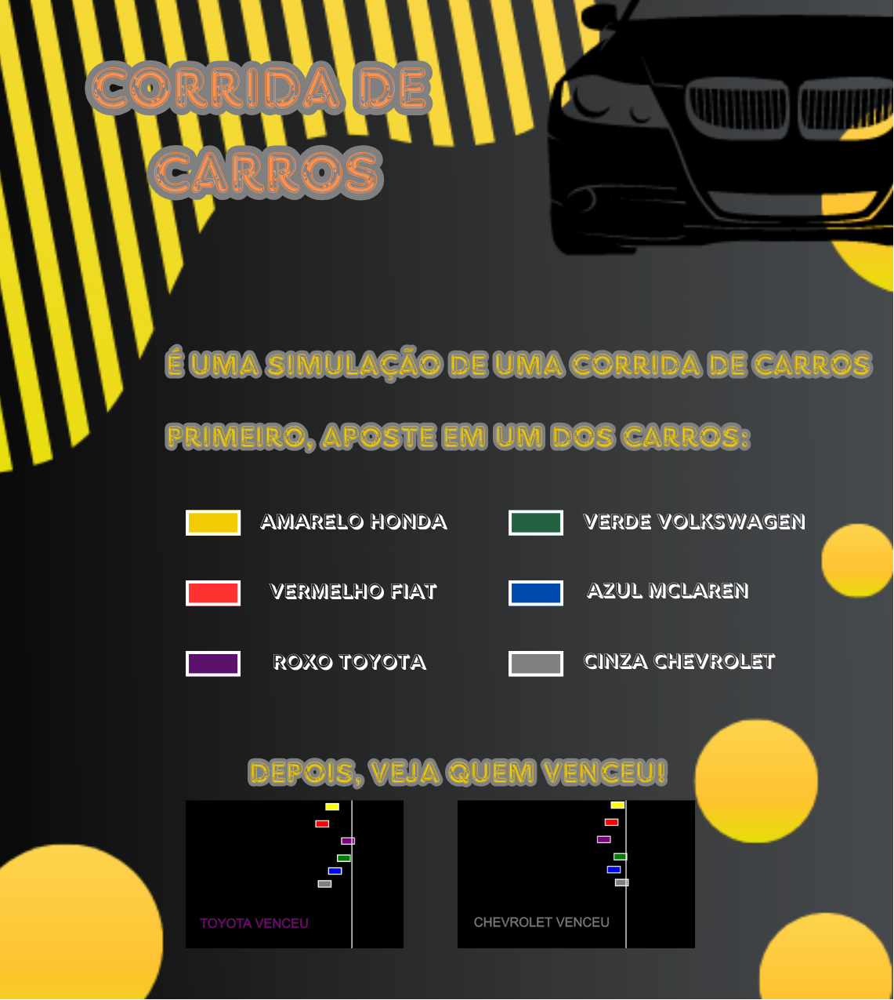

# Corrida-no-P5.JS
App de corrida feito com Javascript e P5.JS.

# Corrida-Agrinho

O projeto é uma simulação de corrida de carrinhos, representados pela forma geométrica retângulo no P5.JS.

# COMO USAR

# CRÉDITOS

DESENVOLVIDO ATRAVÉS DO P5.JS. ACESSE: https://editor.p5js.org/

PARTE GRÁFICA FEITA COM CANVA. ACESSE: https://www.canva.com/pt_br/
